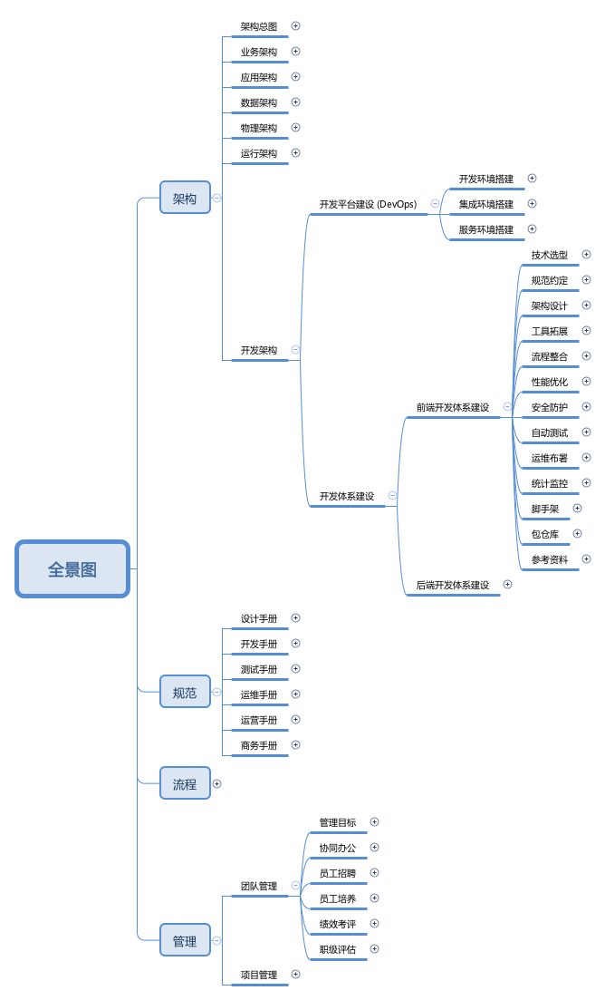

# 开发架构建设

## 1 开发环境搭建

待完善

## 2 集成环境搭建

待完善

## 3 服务环境搭建

待完善

## 4 开发体系建设

### 4.1 前端开发体系建设

1. 技术选型
2. [规范约定](https://github.com/xix-team/spec)
3. 架构设计
4. 工具拓展
5. 流程整合
6. 性能优化
7. 安全防护
8. 自动测试
9. 运维布署
10. 统计监控
11. 脚手架建设
12. 包仓库建设

### 4.2 后端开发体系建设

待完善
